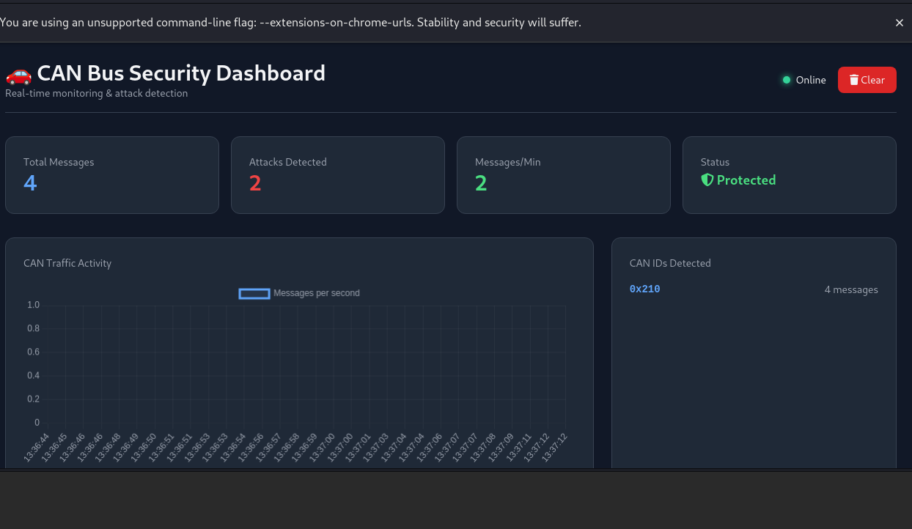
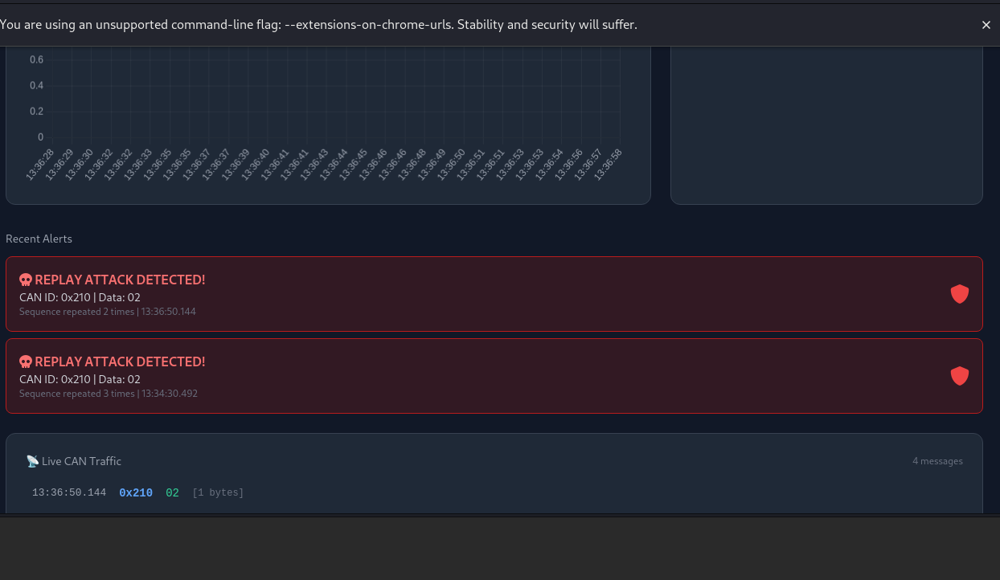
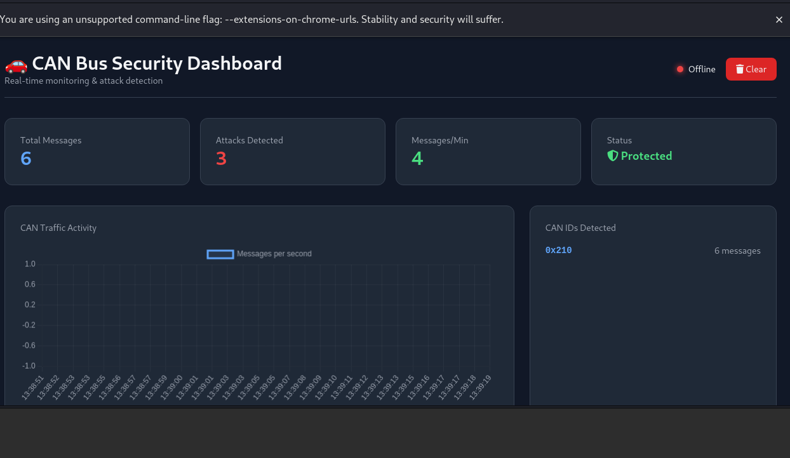
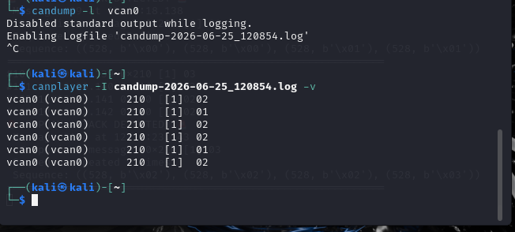
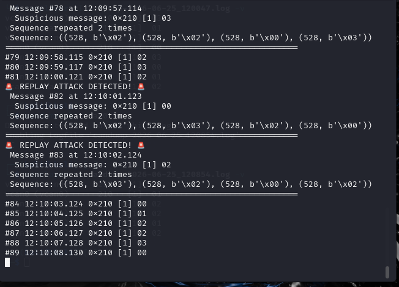
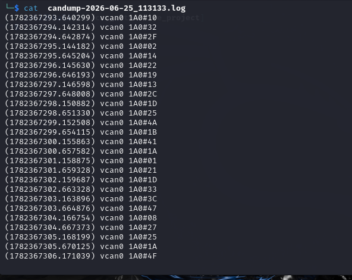
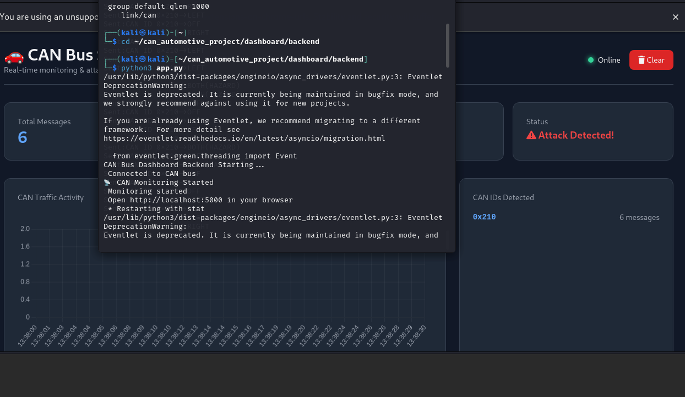
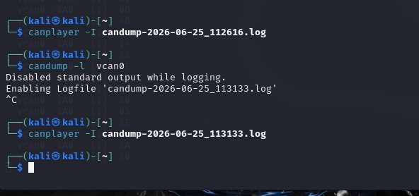

# 🚗 CAN Bus Automotive Security Testing Platform

[](https://www.python.org/)
[](https://flask.palletsprojects.com/)
[](LICENSE)
[](http://makeapullrequest.com)

> A complete end-to-end automotive security testing platform for CAN Bus simulation, attack execution, and real-time attack detection.

---

##  Overview

Modern vehicles are essentially connected computers on wheels. The **Controller Area Network (CAN)** is the communication protocol used in vehicles, but it **lacks authentication** — making it vulnerable to various attacks.

This project demonstrates:
- **Offensive Security:** How attackers can exploit CAN Bus vulnerabilities
- **Defensive Security:** How to detect and respond to these attacks
- **Professional Dashboard:** Real-time visualization and monitoring

---

##  Why This Matters

| Attack Type | Impact | Real-World Example |
|-------------|--------|-------------------|
| **Replay Attack** | Control vehicle functions | Turning signals, unlocking doors |
| **Spoofing** | Send fake messages | Display wrong speed, disable brakes |
| **DoS Attack** | Flood the network | Disable critical ECUs |

**This project helps you understand and defend against these threats.**

---


---

##  Features

###  Offensive Security
| Feature | Description |
|---------|-------------|
| **ECU Simulation** | Simulate Turn Signal and Speed Sensor ECUs |
| **Traffic Capture** | Record CAN messages to log files |
| **Replay Attack** | Retransmit captured messages to control ECUs |

###  Defensive Security
| Feature | Description |
|---------|-------------|
| **Real-time Monitoring** | Live CAN traffic inspection |
| **Sequence Detection** | Identify replay attacks by pattern recognition |
| **Instant Alerts** | Immediate notification on attack detection |

###  Dashboard
| Feature | Description |
|---------|-------------|
| **Live Traffic Feed** | Real-time CAN message streaming |
| **Statistics Cards** | Message counts, attack counts |
| **Real-time Charts** | Traffic activity visualization |
| **CAN ID Tracking** | Monitor active ECUs |
| **Attack Alerts** | Visual alerts with animations |

---

## 🛠️ Tech Stack

| Layer | Technology |
|-------|------------|
| **CAN Bus** | SocketCAN, python-can, vcan0 |
| **Backend** | Python 3, Flask, Flask-SocketIO |
| **Frontend** | HTML, CSS, JavaScript, Tailwind CSS |
| **Real-time** | WebSockets, Socket.IO |
| **Visualization** | Chart.js |
| **OS** | Linux (Kali/Ubuntu) |

---
##  Screenshots

###  Live Dashboard
*Real-time CAN traffic monitoring with live updates*



---

###  Dashboard with Attack Detection
*Professional dashboard showing live traffic, statistics, and attack alerts*



---

###  Real-time Traffic Visualization
*Interactive chart showing CAN traffic activity over time*



---

###  Replay Attack in Progress
*Capturing and replaying CAN traffic using canplayer*



---

###  Attack Detection Alert
*Instant alert when replay attack is detected with sequence details*



---

###  CAN Traffic Log
*Captured CAN log file showing speed sensor messages*



---

###  Backend Processing
*Flask backend running with WebSocket support*



---

### Capture & Replay
*Creating log file and performing replay attack*



##  Installation

### Prerequisites

```bash
# Update system
sudo apt update

# Install CAN utilities
sudo apt install can-utils -y

# Install Python packages
pip3 install python-can flask flask-socketio flask-cors eventlet
